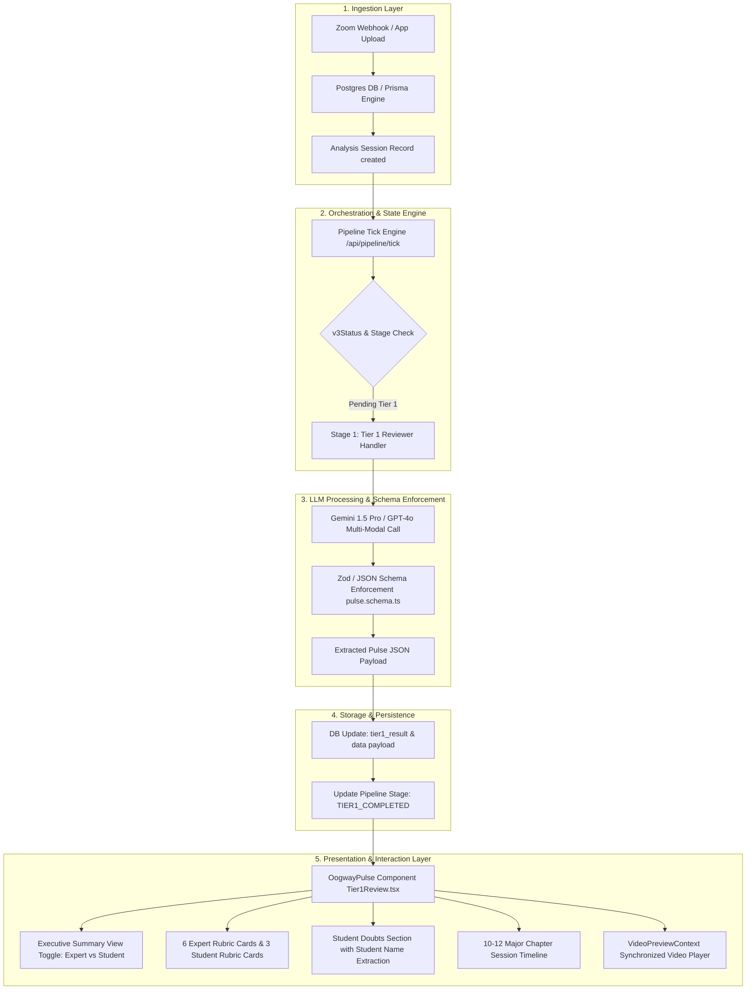

# 🏛 Oogway Pulse — Comprehensive System Architecture & Technical Specification

**Version:** 2.1.0  
**Status:** Production (Deployed on `main`)  
**Repository:** `cyrustaneja/oogway.ai`  

---

## 1. Executive Summary & Core Objective

**Oogway Pulse** is the automated classroom intelligence engine of Oogway. It ingests raw session video recordings and audio transcripts (from Zoom, MP4, or VTT files), executes a multi-stage LLM evaluation pipeline, extracts structured expert execution and student behavior insights, and renders an interactive, real-time evaluation dashboard.

---

## 2. High-Level Architecture Diagram



---

## 3. Data Ingestion & State Machine

### 3.1 Database Schema (`Analysis` Entity)
- **`v3Status`**: Processing state (`QUEUED`, `PROCESSING`, `TIER1_COMPLETED`, `COMPLETED`, `FAILED`).
- **`pipeline_stage`**: Step indicator (`STAGE1_TIER1`, `STAGE2_DEEP`, `DONE`).
- **`tier1_result` / `data`**: JSONB column storing the structured output.
- **`videoUrl` & `transcriptUrl`**: Public / S3 URLs for video playback and transcript VTT file.

### 3.2 Robust Status Evaluator (`isPulseDone`)
To prevent false "Error" badges from historical timeout sweeps:
```ts
const isPulseDone = Boolean(
  analysis.tier1Result ||
  analysis.tier1_result ||
  analysis.data?.expert_insights ||
  analysis.v3Status === "TIER1_COMPLETED" ||
  analysis.v3Status === "COMPLETED" ||
  analysis.pipeline_stage === "STAGE1_TIER1"
);
```

---

## 4. LLM Schema Enforcement Layer (`lib/pipeline/schemas/pulse.schema.ts`)

The raw transcript is processed using strict JSON Schema output definitions:

```typescript
export const pulseResponseSchema = {
  type: SchemaType.OBJECT,
  properties: {
    overall_expert_summary: {
      type: SchemaType.OBJECT,
      properties: {
        right: { type: SchemaType.STRING },
        wrong: { type: SchemaType.STRING },
        action: { type: SchemaType.STRING }
      },
      required: ["right", "wrong", "action"]
    },
    overall_student_summary: {
      type: SchemaType.OBJECT,
      properties: {
        right: { type: SchemaType.STRING },
        wrong: { type: SchemaType.STRING },
        action: { type: SchemaType.STRING }
      },
      required: ["right", "wrong", "action"]
    },
    session_flow: {
      type: SchemaType.ARRAY,
      description: "Chronological key milestones (max 10-12 major chapters)",
      items: {
        type: SchemaType.OBJECT,
        properties: {
          chapter: { type: SchemaType.STRING },
          start_timestamp: { type: SchemaType.STRING },
          end_timestamp: { type: SchemaType.STRING },
          summary: { type: SchemaType.STRING },
          issue: { type: SchemaType.STRING }
        },
        required: ["chapter", "start_timestamp", "end_timestamp", "summary", "issue"]
      }
    },
    expert_insights: {
      type: SchemaType.ARRAY,
      description: "Exactly 6 items corresponding to Expert Metrics",
      items: {
        type: SchemaType.OBJECT,
        properties: {
          metric: { type: SchemaType.STRING }, // Context Setting, Pacing, Analogies, Accuracy, Question Resolution Way, Teaching Depth
          summary: { type: SchemaType.STRING }, // 1-sentence section summary
          pointers: {
            type: SchemaType.ARRAY,
            items: {
              type: SchemaType.OBJECT,
              properties: {
                right: { type: SchemaType.STRING },
                wrong: { type: SchemaType.STRING },
                reason: { type: SchemaType.STRING },
                action: { type: SchemaType.STRING },
                timestamps: { type: SchemaType.ARRAY, items: { type: SchemaType.STRING } },
                proof: { type: SchemaType.STRING }
              }
            }
          }
        }
      }
    },
    student_insights: {
      type: SchemaType.ARRAY,
      description: "Exactly 3 items corresponding to Student Metrics",
      items: {
        type: SchemaType.OBJECT,
        properties: {
          metric: { type: SchemaType.STRING }, // Engagement, Doubts Quality, Confusion Signals
          summary: { type: SchemaType.STRING },
          pointers: { type: SchemaType.ARRAY }
        }
      }
    },
    student_questions: {
      type: SchemaType.ARRAY,
      description: "All genuine functional questions and doubts asked by students",
      items: {
        type: SchemaType.OBJECT,
        properties: {
          student_name: { type: SchemaType.STRING }, // e.g. "Ananya", "Rohan", "Student 1"
          question: { type: SchemaType.STRING },
          timestamp: { type: SchemaType.STRING },
          concept: { type: SchemaType.STRING },
          resolution_status: { type: SchemaType.STRING } // Resolved | Partially Resolved | Unresolved
        }
      }
    }
  }
};
```

---

## 5. UI Presentation Engine (`components/analysis/Tier1Review.tsx`)

### 5.1 Expert Execution vs. Student Behavior View Toggle
Allows the user to seamlessly toggle between evaluating **Expert Execution** (Context Setting, Pacing, Analogies, Accuracy, Question Resolution, Teaching Depth) and **Student Behavior** (Engagement, Doubts Quality, Confusion Signals, Genuine Questions).

### 5.2 Section Preview Cards (`InsightCard`)
Every metric section card renders:
1. **Header Line:** Metric Name (*e.g. Pacing*), top 2 timestamps (*e.g. 00:30:17, 00:34:12*), expand chevron.
2. **Overarching Section Summary:** `insight.summary` (1-sentence executive summary).
3. **Full Highlight Pointers:** Complete, un-truncated text lines for `🟢 Right: ...`, `🔴 Flaw: ...`, `🎯 Action: ...`.

### 5.3 Student Genuine Questions & Doubts Section
Renders each extracted student doubt with:
- **Student Avatar & Name:** Student initials bubble + full name (`student_name`).
- **Question Text:** Exact conceptual doubt asked by the student.
- **Concept Topic Badge:** Topic tag (*e.g. Conversions API*).
- **Resolution Status Badge:** Color-coded status (*Resolved*, *Partially Resolved*, *Unresolved*).
- **Interactive Timestamp Pill:** Click/hover trigger for video preview.

### 5.4 Session Flow Timeline
Renders the **10–12 major session chapters** chronologically with timestamp duration badges and issue flags.

---

## 6. Synchronized Video Preview Engine (`components/analysis/VideoPreviewContext.tsx`)

```typescript
// Architecture of VideoPreviewContext
export function VideoPreviewProvider({ children, videoUrl, onNavigate }) {
  // 1. Coordinates popup position near hover target
  // 2. Listens for mousedown / click events outside container to close popup
  // 3. Renders PreviewVideoPlayer starting at exact transcript timestamp
  // 4. Provides clean Play / Pause overlay controls (No 10s timer limit)
}
```

- **Playback Start:** Sets `video.currentTime = timestamp` immediately upon mount.
- **Continuous Playback:** No 10-second timer cutoff.
- **Outside Click & Mouse Leave Dismissal:** Closes when user mouse leaves or clicks anywhere outside the player.

---

## 7. Deep Analysis Action Button Integration (`SessionTabs.tsx`)

The **Deep Analysis** header button allows users to run Tier 2 deep analysis on demand:
- Executes `POST /api/analysis/[id]/run-deep`.
- Displays active loading spinner (`Running Deep Analysis...`).
- Auto-unlocks and reloads session tabs upon completion.

---

## 8. Summary of Main Code Files

| File Path | Description |
| :--- | :--- |
| [`lib/pipeline/schemas/pulse.schema.ts`](file:///Users/cyrustaneja/Desktop/Product/Oogway/lib/pipeline/schemas/pulse.schema.ts) | Zod / JSON Schema definition for LLM structured output |
| [`lib/pipeline/handlers/stage1-tier1-reviewer.ts`](file:///Users/cyrustaneja/Desktop/Product/Oogway/lib/pipeline/handlers/stage1-tier1-reviewer.ts) | Stage 1 Tier 1 LLM handler execution & prompt |
| [`components/analysis/Tier1Review.tsx`](file:///Users/cyrustaneja/Desktop/Product/Oogway/components/analysis/Tier1Review.tsx) | Main `OogwayPulse` UI component rendering cards, summary, doubts, and timeline |
| [`components/analysis/SessionTabs.tsx`](file:///Users/cyrustaneja/Desktop/Product/Oogway/components/analysis/SessionTabs.tsx) | Container tab navigation bar & Deep Analysis action button |
| [`components/analysis/VideoPreviewContext.tsx`](file:///Users/cyrustaneja/Desktop/Product/Oogway/components/analysis/VideoPreviewContext.tsx) | Synchronized video preview player context & controls |
| [`app/(dashboard)/dashboard/SessionTable.tsx`](file:///Users/cyrustaneja/Desktop/Product/Oogway/app/(dashboard)/dashboard/SessionTable.tsx) | Dashboard session list table & robust status evaluator |

---

*Document compiled for Oogway Engineering & Product Team.*
